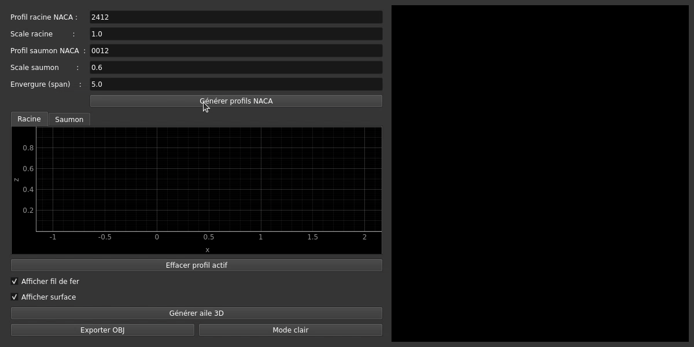

# Concepteur d'aile 3D Interactive

Un outil interactif en Python pour dessiner ou générer deux profils d'aile (racine & saumon), créer un maillage 3D interpolé, visualiser le résultat grâce à OpenGL et l'exporter en .obj.

---

## Fonctionnalités

- **Dessiner ou générer** des profils 2D :
  - Saisie manuelle par clic dans l'interface.
  - Génération automatique via code NACA 4 chiffres.
- **Rééchantillonnage uniforme** des profils selon leur longueur.
- **Interpolation linéaire** entre racine et saumon, avec **twist** paramétrable.
- **Rendu OpenGL** accéléré via `pyqtgraph.opengl` :
  - Affichage fil de fer (wireframe).
  - Affichage de la surface texturée.
  - Cases à cocher pour basculer l'affichage.
- **Exportation en Obj** de l'objet 3d en .obj

---

## Prérequis

- Python 3.6 ou supérieur
- Bibliothèques Python :
  - `numpy`
  - `PyQt5`
  - `pyqtgraph`

Vous pouvez installer ces dépendances via :

```bash
pip install numpy PyQt5 pyqtgraph
# ou, si vous avez un fichier requirements.txt :
pip install -r requirements.txt
```

---

## Installation

1. **Cloner le dépôt** :
   ```bash
   git clone https://votre-repo.git
   cd votre-repo
   ```
2. **Installer les dépendances** comme indiqué ci-dessus.
3. **Lancer l'application** :
   ```bash
   python main.py
   ```

---

## Utilisation

1. **Génération NACA** :
   - Saisir les codes NACA (4 chiffres) pour le profil racine et le profil saumon.
   - Cliquer sur « Générer profils NACA ».
2. **Dessin manuel** :
   - Sélectionner l’onglet « Racine » ou « Saumon ».
   - Cliquer pour ajouter des points sur le graphique.
   - Cliquer sur « Effacer profil actif » pour recommencer.
3. **Génération du maillage 3D** :
   - Cocher/décocher « Afficher fil de fer » et « Afficher surface ».
   - Cliquer sur « Générer aile 3D ». Le maillage apparaît dans la vue OpenGL.

---

## Démonstration



---

## Structure du projet

```
├── wing_designer.py               # Code principal
├── capture.gif                    # Exemple de démo
├── requirements.txt               # Liste des dépendances
└── README.md                      # Ce fichier
```

---

## Licence

Ce projet est sous licence MIT. Voir le fichier `LICENSE` pour plus de détails.

---

## Auteur

- Esteban Perrotin – <esteban.perrotin@proton.me>

